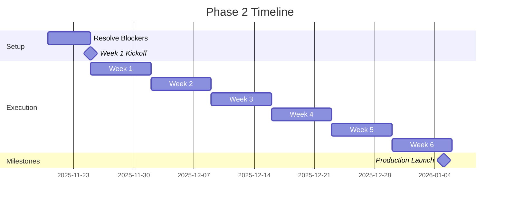

# PHASE 2 SETUP COMPLETE - READY FOR KICKOFF

**Date:** November 20, 2025\
**Status:** ✅ INFRASTRUCTURE READY

---

## WHAT WAS COMPLETED

### 1. ✅ Phase 2 Implementation Plan

**Location:**
`/Users/ali/.gemini/antigravity/brain/dd7f7f04-5ae3-49dd-b0d5-708769ae3fd7/implementation_plan.md`

**Contents:**

- 7 workstreams defined with deliverables, owners, dependencies
- 6-week milestone schedule with acceptance tests
- Updated risk analysis and mitigation strategies
- Resource requirements (tooling, data, people)
- Alignment verification with Mermaid diagrams

**Status:** APPROVED

---

### 2. ✅ Mermaid Diagrams Integrated

**Location:** `/Users/ali/GHOST/diagrams/`

**Files:**

- `ANCHOR_ARCHITECTURE_DIAGRAMS.mermaid` (10 diagrams)
- `ANCHOR_IMPLEMENTATION_DIAGRAMS.mermaid` (12 diagrams)
- `README.md` (usage instructions)

All 22 diagrams validated and syntax-corrected. Now serving as ground truth for
architecture decisions.

---

### 3. ✅ Week 1 Kickoff Materials

**Location:** `/Users/ali/GHOST/PHASE_2_WEEK_1_KICKOFF.md`

**Contents:**

- Critical blockers checklist (4 items)
- Week 1 deliverables for all 5 active workstreams
- Acceptance tests for each deliverable
- Daily standup format
- Friday demo agenda
- Escalation contacts

---

### 4. ✅ Task Tracking Updated

**Location:**
`/Users/ali/.gemini/antigravity/brain/dd7f7f04-5ae3-49dd-b0d5-708769ae3fd7/task.md`

**Changes:**

- Marked Phase 2 Planning as complete
- Added 6-week execution tracker with 24 sub-tasks
- Organized by weekly milestones

---

## CURRENT PROJECT STATE

### Phase 1: ✅ COMPLETE

- Context Engine working (captures page text)
- Smart Fill working (extracts Name, DOB, CC from context)
- Human Emulator working (snail-pace 800ms delays, full action set)
- Smoke test passing (Sarah Connor fills correctly)
- TypeScript lint issues resolved (zero errors)
- Extension loads reliably (macOS quarantine fixed)

### Phase 2: 🟡 READY TO START

- Planning: ✅ DONE
- Infrastructure: ✅ READY (diagrams, docs, checklist)
- Execution: 🔴 BLOCKED (waiting for 4 critical items)

---

## CRITICAL BLOCKERS (MUST RESOLVE BY NOV 25)

### 🔴 Blocker 1: Assign 7 Workstream Leads

**Current Status:** UNASSIGNED\
**Required:**

1. Infrastructure Lead (MCP completion)
2. DOM/Frontend Lead (DOM mapper upgrades)
3. Engine Lead (Fill engine hardening)
4. Clinical QA Lead (OSCAR integration)
5. AI/LLM Lead (LLM integration)
6. Security Lead (PHI audits)
7. DevOps Lead (Deployment automation)

**Action:** Project Manager assigns leads and confirms availability

---

### 🔴 Blocker 2: Provision OSCAR Test Instance

**Current Status:** NOT PROVISIONED\
**Options:**

- A) Self-hosted OSCAR on local server (free, requires setup)
- B) Cloud-hosted OSCAR instance ($100/mo, faster)

**Required:** Accessible URL (e.g., `https://oscar-test.internal`) with 100
synthetic patients

**Action:** DevOps Lead provisions by Nov 25

---

### 🔴 Blocker 3: Obtain OpenAI API Key

**Current Status:** NOT OBTAINED\
**Required:**

- OpenAI account with API access
- API key stored in `agent/.env` (already added `openai` package to
  package.json)
- ~$50 initial credits for dev testing

**Action:** AI Lead obtains key by Nov 25

---

### 🔴 Blocker 4: Approve Budget

**Current Status:** NOT APPROVED\
**Monthly Costs:**

- OpenAI API: $50 (dev) + $500 (prod) = $550/mo
- OSCAR Cloud Hosting (if chosen): $100/mo
- **Total: $650/mo**

**Action:** Finance approves budget by Nov 25

---

## WEEK 1 WORKSTREAMS (NOV 25 - DEC 1)

Once blockers are resolved, these 5 workstreams can start:

| Workstream        | Lead           | Deliverable                            | Acceptance Test                          |
| ----------------- | -------------- | -------------------------------------- | ---------------------------------------- |
| MCP Completion    | Infrastructure | All MCP tools documented               | Docs exist, examples work                |
| OSCAR Setup       | DevOps         | Test instance with 100 patients        | URL accessible, patients loaded          |
| PHI Audit         | Security       | Automated audit suite                  | Smoke test confirms zero PHI transmitted |
| DOM Mapper Design | Frontend       | Upgrade spec with fallback strategy    | Design doc approved                      |
| LLM Prompting     | AI             | GPT-4 generates SOAP note from context | Valid SOAP note generated                |

---

## WEEK 1 ACCEPTANCE CRITERIA

At the end of Week 1 (Dec 1), we should be able to answer YES to these
questions:

1. ✅ Are all MCP tools documented with working examples?
2. ✅ Can we access OSCAR at the test URL and see 100 synthetic patients?
3. ✅ Does the automated PHI audit pass (zero PHI transmitted)?
4. ✅ Can GPT-4 generate a valid SOAP note from sample page context?
5. ✅ Is the DOM mapper upgrade spec approved and ready for implementation?

**If 5/5 YES:** Week 2 can start on schedule\
**If <5 YES:** Identify gaps and mitigate before Week 2

---

## NEXT ACTIONS

### For Project Manager

1. **Assign Leads** - Identify and assign 7 workstream leads
2. **Kickoff Meeting** - Schedule 1-hour kickoff on Nov 25 at 10am
3. **Unblock Budget** - Get $650/mo approved by Finance
4. **Set Up Standups** - Daily 10am standups starting Nov 25

### For DevOps (once assigned)

1. **Provision OSCAR** - Choose self-hosted or cloud option
2. **Load Synthetic Data** - 100 test patients via Mockaroo
3. **Document Access** - Share URL and credentials with team

### For AI Lead (once assigned)

1. **Get OpenAI Key** - Create account, purchase credits
2. **Test API** - Verify connectivity and SOAP note generation
3. **Store Credentials** - Add to `agent/.env` securely

### For All Leads (once assigned)

1. **Review Materials** - Read implementation plan, Week 1 checklist
2. **Prepare Deliverables** - Plan how to deliver Week 1 milestones
3. **Attend Kickoff** - Nov 25 10am kickoff meeting

---

## DOCUMENTATION STRUCTURE

```
/Users/ali/GHOST/
├── diagrams/
│   ├── ANCHOR_ARCHITECTURE_DIAGRAMS.mermaid    ← Ground truth (10 diagrams)
│   ├── ANCHOR_IMPLEMENTATION_DIAGRAMS.mermaid  ← Ground truth (12 diagrams)
│   └── README.md                                ← How to view diagrams
├── PHASE_2_WEEK_1_KICKOFF.md                    ← Week 1 checklist
├── THIS_FILE.md                                 ← Setup summary
└── .gemini/antigravity/brain/.../
    ├── implementation_plan.md                   ← Full Phase 2 plan
    └── task.md                                  ← Task tracker
```

---

## STAKEHOLDER SUMMARY

**For Executives:**

- Phase 2 planning is complete and approved
- 6-week roadmap to production-ready, OSCAR-compatible Anchor Browser
- 4 blockers must be resolved by Nov 25 to start on schedule
- Budget: $650/mo for LLM and hosting

**For Clinical Leadership:**

- Week 5 includes pilot testing with 3 clinicians
- Production deployment scheduled for Week 6 (Jan 5)
- OSCAR compatibility validated in Week 4

**For Technical Team:**

- All architecture diagrams integrated and validated
- TypeScript issues resolved, smoke test passing
- Week 1 has clear deliverables and acceptance tests
- Daily standups start Nov 25

---

## STATUS DASHBOARD

| Category             | Status        | Details                              |
| -------------------- | ------------- | ------------------------------------ |
| **Planning**         | ✅ COMPLETE   | Implementation plan approved         |
| **Diagrams**         | ✅ INTEGRATED | 22 Mermaid diagrams in /diagrams/    |
| **Week 1 Checklist** | ✅ READY      | Blockers and deliverables documented |
| **Task Tracking**    | ✅ UPDATED    | 6-week execution tracker added       |
| **Lead Assignments** | 🔴 BLOCKED    | 7 leads need assignment              |
| **OSCAR Instance**   | 🔴 BLOCKED    | Needs provisioning                   |
| **OpenAI API**       | 🔴 BLOCKED    | Needs API key                        |
| **Budget**           | 🔴 BLOCKED    | Needs approval                       |

**Overall:** 🟡 READY TO START (pending blocker resolution)

---

## TIMELINE



---

**Last Updated:** Nov 20, 2025, 1:58 PM\
**Next Review:** Nov 25, 2025 (Kickoff)\
**Questions?** Contact Project Manager

**Status:** ✅ SETUP COMPLETE - READY FOR KICKOFF WHEN BLOCKERS RESOLVED
